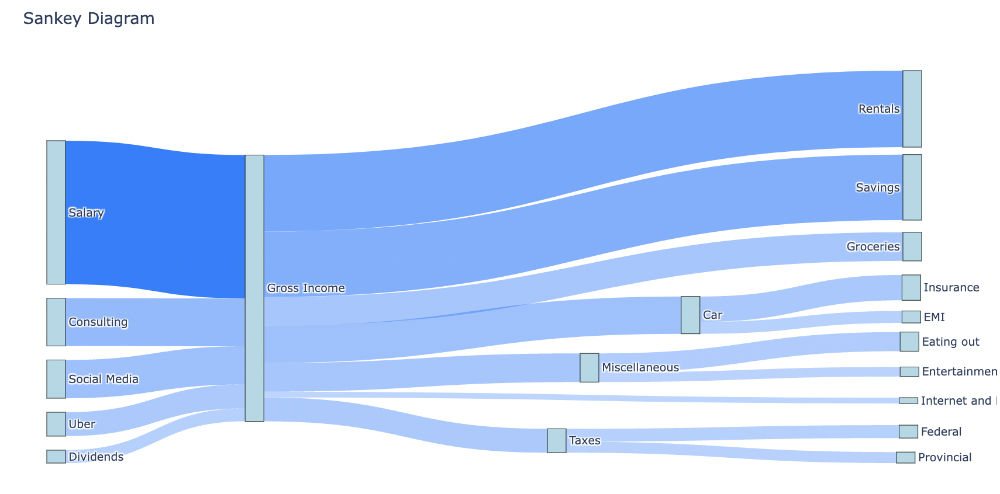
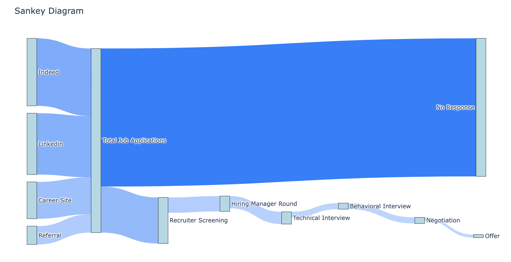

# SankeyGraphsForEverything
Sankey graphs are one of the most interesting visualizations. Jupyter notebooks are my hammer and every problem is a nail.

## What is a Sankey Graph?
A Sankey graph is a type of flow diagram that shows the flow of data between different categories. It is a useful tool for visualizing data relationships and patterns.

## How to get ready
1. Clone the repository: `git clone https://github.com/hrmeetsingh/SankeyGraphsForEverything.git`
2. Navigate to the repository directory: `cd SankeyGraphsForEverything`
3. Create a virtual environment: `python3 -m venv venv`
4. Activate the virtual environment: `source venv/bin/activate`
5. Install the required dependencies: `pip install -r requirements.txt`
6. Run the notebook: `jupyter notebook SankeyGraphsForEverything.ipynb`
7. Open the notebook in your browser: `http://localhost:8888/notebooks/SankeyGraphsForEverything.ipynb`
8. Input your data and enjoy your Sankey Graphs!

## Inputting data
### Manual input

1. Add Source, Target and Value fields
2. Click on "Add New Flow" button to add a new row to the table
3. After everything is in, click the "Create Diagram" button to generate the graph

### Persisting data

#### Saving the input data
1. Check the data is correctly accepted
2. Give a file name in the "Filename" field
3. Click the "Save Data" button on the top, the file is saved as a json or csv, depending on the chosen option, in the same directory as notebook

#### Loading saved data
1. Provide the file name in "Filename" field
2. Click the "Load Data" button on the top

## Examples
### Home Budget Graph
Load the file "monthly_budget_sample.json" from project directory to create the graph

### Job Search Journey
Load the file "job_search_journey_sample.json" from project directory to create the graph

## License
This project is licensed under the MIT License - see the [LICENSE](https://github.com/hrmeetsingh/SankeyGraphsForEverything/blob/main/LICENSE.md) file for details.

